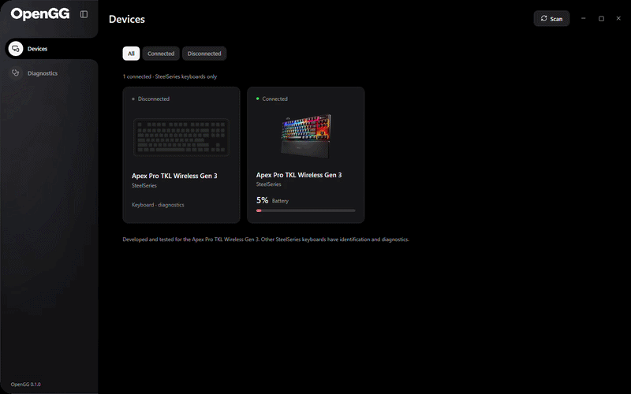

<div align="center">

<picture>
  <source media="(prefers-color-scheme: dark)" srcset="docs/assets/opengg-full-white.png">
  
</picture>

**Your keyboard. Your software. An open protocol.**

[](docs/getting-started.md)
[](LICENSE)
[](docs/protocol.md)
[](docs/verification.md)
[](docs/interface.md)

[Get started](docs/getting-started.md) · [Visual guide](docs/interface.md) · [Protocol reference](docs/protocol.md) · [Research log](docs/research-log.md) · [Diagnostics](docs/diagnostics.md) · [Contribute](CONTRIBUTING.md)

</div>

## From OneRGB to OpenGG

**OneRGB is the owner's complete, closed-source personal hardware-control application. OpenGG is the SteelSeries keyboard section of that application, extracted into a standalone project.** The owner chose to publish this section because the advanced Apex Gen 3 protocol findings are useful to anyone building their own keyboard software. OneRGB's interface design, keyboard artwork and OpenGG branding were created by the owner.

OpenGG is a Windows **SteelSeries GG alternative for keyboard control and protocol research**. It communicates directly through native USB HID, with no GG installation, privileged background service or Python dependency for the desktop. It includes a focused device interface, an Apex keyboard editor, keyboard-specific diagnostics and an independent Python CLI.

The project documents original reverse engineering of **Apex Pro TKL Wireless Gen 3 actuation, Rapid Trigger, Protection Mode, Rapid Tap / SOCD, onboard profiles, RGB lighting and OLED communication**. It provides exact byte layouts, complete-file reconstruction, hardware evidence and reproducible tools so that others can extend or implement these controls.

> Advanced configuration was developed and tested on **Apex Pro TKL Wireless Gen 3 over its 2.4 GHz receiver (`1038:1644`) and USB cable (`1038:1646`), firmware 3.24.1, profile schema 19**. Discovery of another SteelSeries keyboard does not establish that its advanced protocol is supported.



## What you can control

| Capability | Tested Apex Gen 3 wireless / USB | Other SteelSeries keyboards |
|---|---|---|
| Device discovery and remembered connection state | Yes | Standard keyboard HID collection discovery; real model coverage needs testing |
| Battery level and charging animation | Native telemetry, polled every second | Requires a validated model-specific query |
| Per-key actuation, 0.1–4.0 mm | Live and onboard | Diagnostics |
| Per-key Rapid Trigger and sensitivity | Live and onboard | Diagnostics |
| Protection Mode | Per-key flags and raw sensitivity; explicit onboard save | Diagnostics |
| Rapid Tap / SOCD, remapping, Meta and dual actuation | Profile editing; command acceptance and storage verified | Diagnostics |
| Internal profiles, slots 1–5 | Read, activate, backup and write; exact receiver readback wirelessly, exact keyboard readback over USB | No advanced writes |
| RGB lighting | Per-key native frames, six effects and original layered preview | No unverified RGB writes |
| OLED display | 128×40 monochrome preview, image import and temporary display send; persistent bitmap through CLI | No unverified OLED writes |
| Keyboard diagnostics | Connection, battery, profile schema/CRC/hash and optional live ACK test | Interface inventory and bounded read-only feature probe |
| Macro data | Local library; existing native bytes preserved | No native macro compiler |

Command acceptance and stored-byte verification do not measure physical switch depth. The separate wired-only model `1642`, Bluetooth, other models and every possible action combination remain unvalidated. Cable support here means the **wireless model connected by USB**, not the wired-only Apex. The [verification report](docs/verification.md) separates working paths from remaining hardware work.

## A focused keyboard interface

OpenGG has two sidebar sections: **Devices** and **Diagnostics**. It keeps the original OneRGB cards, integrated window controls, curved sidebar and owner-created layered keyboard artwork. Compact navigation retains the selected white circle and black contour; hovering another icon enlarges it smoothly without a background pill. The toggle shares the icon centerline, and the logo fades as the sidebar slides.

The Apex editor starts with RGB and OLED. A compact status card shows battery, the OpenGG RGB control switch and useful profile/communication feedback. The key map combines onboard-profile buttons, selection controls and three vertical sliders. Independent orange Rapid Trigger and blue Protection tools paint keys directly. Presets, Rapid Tap and Macros share one tabbed card; its height stays stable when an empty tab is selected.

<details>
<summary><strong>Explore the editor and diagnostic screenshots</strong></summary>


</details>

Brightness fades the RGB overlay toward transparency, exposing the original gray keyboard beneath. OLED uses the same display region inside the artwork and zooms across the full preview card. Color/OLED and keyboard-tool transitions retain layout space and respect Windows' reduced-motion setting. [Full visual guide](docs/interface.md).

## Start using OpenGG

1. Extract `OpenGG-0.1.0-win-x64.zip` into a writable folder and open **`OpenGG.exe`**. Keep its files together; the portable package includes the .NET runtime.
2. Connect the tested keyboard through its **2.4 GHz receiver or USB cable**. If both interfaces are present, their cards identify the transport and opening a card selects that exact channel; the default is USB. Exit other keyboard controllers, including GG/Engine, Prism, OneRGB, OpenRGB and SignalRGB.
3. Click **Scan** or press **F5**, then open the keyboard card. A remembered card remains visible when disconnected. An empty list says **No devices found**.
4. Select an onboard slot and click **Read and activate** before advanced edits. The default slot is 2; loading a slot replaces the editor and runtime values with its stored settings.
5. Select keys, WASD or All, then adjust actuation. Use the lightning and shield buttons to paint Rapid Trigger and Protection; click a painted key again to remove that feature. In painting mode, WASD/All enable the active feature and Clear removes it from all keys.
6. Use **Save to keyboard** for an explicit persistent change. OpenGG compares the baseline, creates a backup and verifies exact readback. Wireless mode writes keyboard and receiver copies; USB writes and reads back the keyboard copy directly. A no-change save avoids a flash transaction.

Actuation and Rapid Trigger edits apply live after activation without writing flash. Protection sensitivity and other profile edits require the explicit save. A communication failure stops the remaining changes and requires a fresh read/activation. [Usage, local files and recovery](docs/getting-started.md).

### OLED images and the 1.5 mm display observation

Choose **OLED**, then **Open File** to import PNG, JPEG, BMP, GIF or TIFF. Built-in Windows decoders fit the image without stretching, composite transparency over black and dither it to a 128×40 one-bit bitmap. GIF/TIFF use the first frame/page. Limits are 16 MiB, 32 megapixels and 32,768 pixels per dimension.

The panel and keyboard artwork display the exact converted bitmap sent through `0x4A`. Turning **Show on keyboard display** off restores the stored background through `0x4B`. Imports are temporary session overlays; an ordinary profile save preserves the existing onboard OLED bytes. Use the CLI's explicit `oled_hex` edit for persistent images. The depth slider is an input simulation, not a sensor readback.

> **Setting 1.5 mm can show 1.4 mm on the physical OLED.** The owner reproduced this with SteelSeries GG as well as OpenGG. The native wheel menu moves in 0.2 mm steps while software exposes 0.1 mm. OpenGG preserves the confirmed 1.5 mm encoding `28/31`; no compensating offset is applied. Physical threshold precision was not independently measured.

## Fast updates, with one shared HID channel

The original failure path retried complete configuration sends separately for each selected key. The corrected path stages the full final map and sends **one complete 68-entry actuation report (`0x6F` wireless / `0x2F` USB) for all 60 visible analog keys**. Unselected values remain intact. Rapid Trigger changes are grouped into their own reports.

| Measurement on the tested keyboard | Elapsed |
|---|---:|
| Earlier native path, 60 separate actuation reports | 8.541 s |
| Native grouped update during continuous RGB | 0.144 s |
| Standalone OpenGG native grouped update, receiver | 0.149 s |
| Native USB cable update during continuous RGB | 0.144 s |
| Recorded OpenGG desktop batch completion | About 0.19 s |

RGB, telemetry, OLED and configuration use the same serialized channel. Before advanced commands, temporary RGB is released with `0x62` wirelessly or `0x22` over USB and the measured settling delay. These are measurements on one keyboard, not latency guarantees. [Timings, checks and evidence boundaries](docs/verification.md).

## The protocol is documented, not hidden behind the UI

| Protocol family | Identified path |
|---|---|
| Connection and battery | Wireless `0xBC` / `0xD2`; USB battery `0x92` |
| Live actuation | `0x6F` wireless / `0x2F` USB, full key map |
| Rapid Trigger | Wireless `0x76` / `0x77`; USB `0x36` / `0x37` |
| Profile read/write/validation | Full 12,288-byte schema-19 reconstruction and CRC |
| Temporary RGB ownership | `0x62` release and native per-key output frames |
| OLED overlay/reset | Wireless `0x4A` / `0x4B`; USB `0x0A` / `0x0B`; 640-byte monochrome bitmap |
| Protection, Rapid Tap, remap, Meta and dual actions | Documented native profile offsets and preserved-field edits |

**OpenGG's contribution is the original advanced Gen 3 protocol investigation and working implementation recorded here.** RGB and OLED had earlier public implementations: [OpenRGB's Gen 3 wireless RGB work](https://gitlab.com/CalcProgrammer1/OpenRGB/-/merge_requests/3143) and [OmniLED's Apex OLED support](https://github.com/llMBQll/OmniLED). This repository does not claim to be the first project to decode every SteelSeries protocol. Prior work is distinguished from capture-derived findings in the [sources](docs/sources.md) and [research log](docs/research-log.md).

| Read this | To understand |
|---|---|
| [Documentation index](docs/index.md) | The complete guide and reading order |
| [Protocol reference](docs/protocol.md) | HID identity, packet families, response matching and ownership |
| [Profile format](docs/profile-format.md) | Field offsets, CRC, key masks and minimal edits |
| [Actuation tables](docs/profile-format.md#actuation-lookup) | Exact nonlinear threshold encodings |
| [Key mapping](docs/profile-format.md#hid-usage-versus-physical-index) | HID usages, physical indices and preserved hidden keys |
| [Research log](docs/research-log.md) | Step-by-step investigation, failures, corrections and UI extraction |
| [Reproduce the research](docs/reproduce.md) | Capture reconstruction, CLI and explicit hardware checks |
| [Architecture](docs/architecture.md) | Shared transport, arbitration, batching and source integration |
| [OneRGB integration](docs/onergb-integration.md) | Updated Apex section, original canvas reuse and backport checks |
| [Hardware verification](docs/verification.md) | What was actually tested and what remains unproven |
| [Import provenance](docs/import-provenance.json) | Original OneRGB hashes and adapted destinations |

### Independent Python CLI

Offline analysis and editing use Python's standard library. Hardware access additionally needs `hidapi`; a local Python/hidapi environment can be prepared through Diagnostics.

```powershell
python tools/opengg.py --help
python tools/opengg.py read --pid 0x1646 --slot 2 --profile local-research/profile-2.bin
python tools/opengg.py edit --profile local-research/profile-2.bin --edits tools/profile-edits.example.json --out local-research/edited.bin
```

Explicit write and live commands, exact setting names, backups and validation requirements are covered in [the reproducibility guide](docs/reproduce.md). Original capture files, full backups and the conversation snapshot remain in the gitignored private `local-research/` archive.

## Diagnostics and offline research tools

Diagnostics runs the transport-specific identification protocols for the verified receiver and USB keyboard and collects standard HID identity, interface sizes, usages and grouping for other keyboards. Its report distinguishes ACKs, raw telemetry, CRC/hash results, unsupported capabilities and errors. Optional live tests are explicit; ordinary diagnostics do not activate or save an onboard profile.

The tools panel has **Documentation** and **Install / Prepare / Open folder** actions. The full local portable package carries 66 checksum-recorded offline payload files. Source checkouts include the manifest and fetch/install scripts; installers are excluded from Git.

| Tool | Purpose |
|---|---|
| OpenGG HID inventory | Native Windows HID inventory and JSON export |
| OpenGG protocol CLI | Independent profile reading, editing, backups and live batches |
| Capture Analyzer | Decode captured traffic and reconstruct complete profile banks |
| TWUSB / ETW Capture | Windows USB event tracing through the included capture script |
| USBView | USB descriptors, interfaces and report identity |
| USBPcap and Wireshark | Driver capture and USB packet inspection |
| Python and hidapi | Local command-line hardware research environment |
| Frida | Instrumentation for protocol identification |

Python and Frida are prepared within the writable OpenGG folder. System tools open their original interactive installers. No system installer is executed automatically. [Tool versions, payloads, checksums and installation](tooling/README.md) · [Diagnostic guide](docs/diagnostics.md).

## Build from source

Use Windows x64 and the **.NET 10 SDK**. The desktop has no additional third-party runtime library requirement.

```powershell
dotnet build OpenGG.slnx -c Release
dotnet run --project src/OpenGG.Desktop/OpenGG.Desktop.csproj -c Release

# Fetch pinned research payloads, then publish the app and offline installers.
powershell -ExecutionPolicy Bypass -File tools/Fetch-ResearchTools.ps1
powershell -ExecutionPolicy Bypass -File tools/build.ps1

# Or publish the smaller app-only package.
powershell -ExecutionPolicy Bypass -File tools/build.ps1 -WithoutResearchTools

# Regenerate PNGs and the multi-size ICO from the owner's four original SVGs.
powershell -STA -ExecutionPolicy Bypass -File tools/Build-BrandAssets.ps1
```

```text
OpenGG/
├── src/OpenGG.Desktop/    WPF device cards, keyboard editor, RGB/OLED, diagnostics
├── src/OpenGG.Core/       Native HID, protocol, profiles and control arbitration
├── tools/                CLI, capture, analysis, brand export and packaging scripts
├── tests/                Offline and explicit native Windows checks
├── tooling/              Installer manifest, offline cache and optional local Python
└── docs/                 Protocol, byte tables, research, screenshots and evidence
```

## Test and contribute

```powershell
dotnet run --project tests/OpenGG.Checks/OpenGG.Checks.csproj -c Release
python tools/test_opengg.py

# Close OpenGG first. This opens and checks a real WPF window.
dotnet run --project tests/OpenGG.DesktopChecks/OpenGG.DesktopChecks.csproj -c Release
powershell -ExecutionPolicy Bypass -File tools/Test-ResearchTools.ps1
```

The current validation includes **90 offline core checks and 77 native desktop checks on the tested setup**, plus Python tests and seven offline installer plans. The desktop checks exercise templates, battery updates, bottom-up sliders, independent painting, panel height/scroll retention, OLED conversion and real window geometry. Hardware-dependent checks may be skipped without a verified USB cable or receiver. [Exact evidence](docs/verification.md).

Useful contributions include real captures for other SteelSeries keyboards, additional firmware/Bluetooth transport validation, physical behavior checks, calibrated Protection semantics and native macro compilation. Include HID identity, report lengths, firmware/schema and reproducible results; sanitize captures before sharing. [Contribution guide](CONTRIBUTING.md).

## Questions you may have

**Do I need SteelSeries GG installed?** No. OpenGG sends native HID commands. Avoid simultaneous controllers using the same device.

**Does it support every SteelSeries keyboard?** Discovery targets standard SteelSeries keyboard collections. Advanced control is validated only for the exact Gen 3 wireless model over the receiver and USB identities above. Other models get diagnostics.

**Are edits saved permanently?** Live actuation/RT and temporary RGB/OLED are runtime changes. The explicit Save to keyboard operation persists profile edits with a backup and verification.

**Why does the battery change in steps?** The imported query decodes the selected transport's quantized raw telemetry. Charging animation reflects its charge bit. Percentage mapping is an estimate inherited from OneRGB, not an independently calibrated fuel-gauge measurement.

**Is this an official SteelSeries application?** No. OpenGG is an independent project; SteelSeries product names identify compatible hardware.

---

<div align="center">
<picture>
  <source media="(prefers-color-scheme: dark)" srcset="docs/assets/opengg-secondary-white.png">
  
</picture>

**Built from the owner's OneRGB design and original keyboard artwork.**

[License](LICENSE) · [Source and artwork notices](THIRD_PARTY_NOTICES.md)
</div>
