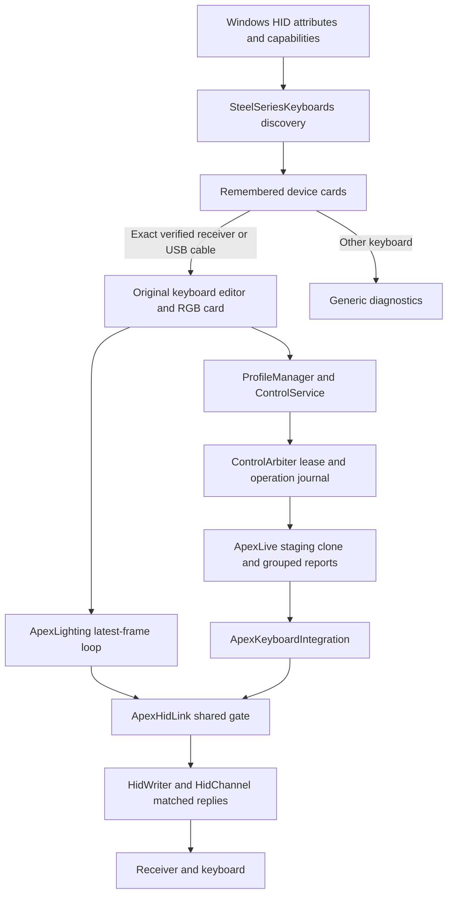

# Architecture and source integration

OpenGG reuses the working OneRGB keyboard path. It has one core assembly and one WPF desktop, no privileged service and no competing renderer or hardware writer. Native Windows calls handle HID; the Python implementation is an optional independent tool.

## Imported and native files

| File / area | Responsibility |
|---|---|
| `OpenGG.Core/SteelSeriesKeyboards.cs` | Keyboard-only discovery, composite grouping and strict tested identity |
| `Windows/HidEnumerator.cs` | SetupAPI/HID attributes and caps, access-zero inventory, Windows Container ID |
| `Application/Devices/Keyboard/ApexProtocol.cs` | HID usages, thresholds, packet layouts, RGB/OLED conversion |
| `Application/Devices/Keyboard/ApexProfile.cs` | Schema/CRC validation, read/patch, effective global setting, untouched-byte preservation |
| `Application/Devices/Keyboard/ApexLive.cs` | Clone/load state and consolidate final report per opcode |
| `Application/Control/ControlService.cs` | Validation, ordered locks, command outcomes, batching and cache invalidation |
| `Application/Profiles/ProfileManager.cs` | Group eligible pending settings and stop a failed resource |
| `Hardware/Integrations/ApexKeyboardIntegration.cs` | Loaded-profile guard, native live/profile operations, current-map diagnostic echo |
| `Hardware/Native/ApexHidLink.cs` | One gate for RGB, live ACKs, telemetry, profiles and OLED |
| `Hardware/Native/HidChannel.cs` | Arm/match interrupt replies, timeout and disposal |
| `Hardware/Lighting/ApexLighting.cs` | Newest frame only, max ~30 Hz, repeats for wake, release and last error |
| `OpenGG.Desktop/AppHost.cs` | Keyboard-only services, discovery, owner cache, independent local storage |
| `MainWindow.xaml` | Imported sidebar/card style with Devices and Diagnostics only |
| `Windows/WindowFrame.cs` / `MainWindow.xaml.cs` | Native rounded region, monitor work area, integrated controls and sidebar animation |
| `Controls/ScrollBehavior.cs` | One shared wheel handler; 144-pixel page steps and nested list edge handoff |
| `ViewModels/KeyboardViewModel.cs` | Existing keyboard selection, editing, live apply, native read/save and OLED |
| `ViewModels/ApexLightingViewModel.cs` | Six effects, shared preview/hardware frame, RGB controls and WASAPI level |
| `Controls/ApexKeyboard.cs` | Owner's layered image preview |
| `ViewModels/MainViewModel.cs` / `DiagnosticTools.cs` | Cards, diagnostics, exports and local research-tool inventory |
| `tools/Fetch-ResearchTools.ps1` / `Install-ResearchTool.ps1` | Prepare the offline cache; verify and install known local payloads |

The imported core keeps `OneRGB.*` namespaces, while its assembly is `OpenGG.Core`. This is source provenance, not a dependency on an installed OneRGB application. Some small imported profile DTOs/key mappings exist to compile the existing keyboard editor; no mouse/controller/service integration is started.

The [import manifest](import-provenance.json) records origin hashes, destinations and final destination hashes. `tools/import_onergb.py` reproduces the **initial extraction only** and overwrites imported files; it is not a build step and must not be run over adapted OpenGG sources. Additional extraction/adaptation is described in the research log and manifest.

## Write and error contract

Before any live batch, ControlService verifies distinct keys, value kinds/ranges, availability, grouping, writer/resource, version and a current lease. Journaling precedes I/O. Safe unreadable keyboard settings opt into batching; unrelated/high-risk/readable controls do not implicitly acquire this behavior.

The keyboard integration clones the current loaded map. `ApexLive` produces the final complete report for each setting family. `ApexHidLink.SendFeaturesAsync` holds one gate across all of them, including temporary-RGB release. Applied state means matched ACK acceptance, not a measured live setting readback. The journal says so.

Failure marks one Failed result and cancels remaining entries instead of retrying each key. The map commits only after the complete send succeeds. Communication failure drops the transport and loaded-state guard; the user must read/activate again. Explicit profile load invalidates stale Applied cache entries, which prevents incorrectly skipping a value the hardware reset when loading.

The shared channel also invalidates that guard after RGB/telemetry failures or an explicit ownership drop. Normal temporary-RGB release closes handles without invalidating the map. Battery queries use this same channel rather than opening a competing interrupt reader. Detection of another controller closes the OpenGG channel and requires a new explicit profile load after that controller exits.

MainViewModel polls the verified card's battery every second without overlapping requests. The existing integration caches the native response for one second, so percentage and charging queries share one telemetry result. Owner/identity checks precede even cached battery access. Nullable percentage and charge state update the same DeviceCardViewModel shared by the device list and status card. Disconnects, blocked ownership and failed reads clear stale telemetry. BatteryBar handles the native shimmer only while charging below full, stops on unload/full charge and respects reduced motion. Its existing quantized percentage conversion remains an uncalibrated estimate.

The editor's locally stored fields support pending profile edits, not fictional hardware support. Remap/Meta/dual/Protection/Tap persist through the explicit onboard transaction. Unsupported host actions and unverified simulator conversions are rejected for flash.

## Discovery and lifecycle

Enumeration opens HID collections with desired access zero and reads attributes/capabilities. Keyboard cards require VID 1038 plus usage page 1/usage 6; grouping uses Windows Container ID, with a PID fallback whose identical-unit limitation is documented. Discovery is refreshed every three seconds without overlapping scans. An absent device retains its remembered card.

The exact transport gate allows only `1038:1644` and `1038:1646`, interface 3, vendor page FFC0/usage 1 and 642/65/65 report sizes. Repeated matching units of the same PID block advanced writes. A receiver and cable may coexist; opening a card pins its exact interface path. Changing or losing that path drops the shared channel and invalidates the loaded live state. Native and CLI defaults prefer USB. Other models use a vendor GetFeature read with a five-second UI deadline and at most one still-pending probe.

Owner inventory is cached at scan time and checked by writes; close other controllers before using the protocol. It is a process inventory guard, not an OS-exclusive ownership guarantee. External processes can still violate that convention; do not run two controllers against the interface.

RGB frames are generated only while the Apex detail is active. Leaving it stops generation/capture and releases temporary RGB. Hardware frames contain brightness exactly once. The preview uses the original OneRGB continuous gradient over frozen PSD layers, with brightness and breathing/audio intensity applied to **opacity**. It never treats key-order frame entries as evenly spaced horizontal gradient stops. This restores the original visual spectrum spacing without changing the hardware frame order. Audio Reactive starts WASAPI output loopback only for that effect. Spectrum bands are not currently used by the six imported effects; the actual audio level is used.

The lighting view references the same KeyboardViewModel as the key-map view. Its Color/OLED panel selection drives an interruptible 360 ms camera animation in ApexKeyboard, focused on the artwork's display rectangle. ApexKeyboard occupies the whole stage; resting margins are part of camera math rather than an inner Viewbox clip. Only the card's rounded outer edge clips the zoom. The actual OledPreview bitmap replaces placeholder lettering inside that rectangle. OledImage uses built-in WPF decoders, black letterboxing/alpha composition and the existing OledFrame dithering/row-bit packing. Pending OLED updates debounce for 200 ms and coalesce while an ACK is pending; the integration retains its serialized transport and ownership checks.

The map paints independent RT and Protection flags. Selecting keys seeds sliders under a synchronization guard, so loading or selecting a key cannot apply values to the selection. Explicit slider edits use the existing 200 ms live-commit path. PaintKeys is shared by individual and bulk operations: WASD/All enable the active feature on supported keys, while Clear removes that feature and preserves the other. One bulk action schedules one edit. Protection sensitivity is a per-key raw byte, retained in local controls and patched at `12156 + physicalIndex` only in the explicit onboard transaction. Its mm conversion and a live raw-sensitivity opcode remain unverified. Panel/mode/tab radio bindings are two-way so mouse, keyboard and UI Automation selection all update the same model.

Motion.PanelActive fades and translates tab panels using the existing timing helpers. Inactive panels use Hidden, retaining their measured height and avoiding ScrollViewer offset clamping on empty tabs. SnapshotAndReplace handles interrupted transitions; reduced-motion makes visibility immediate. Fader binds Track.IsDirectionReversed to the Slider and fills from its minimum at the bottom. Feature accent is set through styles, allowing the disabled gray trigger to take precedence.

The untitled status card reserves its original dimensions for battery, RGB ownership and concise shared feedback. Feedback observes the same keyboard/editor state, including access blocks, load requirements, dirty state, progress and errors. App startup sets English UI and numeric culture; user-authored names/data are untouched. Owner SVGs remain original files, while Build-BrandAssets.ps1 renders white sidebar typography, light/dark README PNGs and a multi-size ICO with native WPF.

Profiles and settings persist to the OpenGG data directory through atomic file replacement. Native flash backups have their own OpenGG directory. RGB preferences save on normal close. Invalid local JSON is copied aside before defaults are used. Operations and application exceptions remain local.
