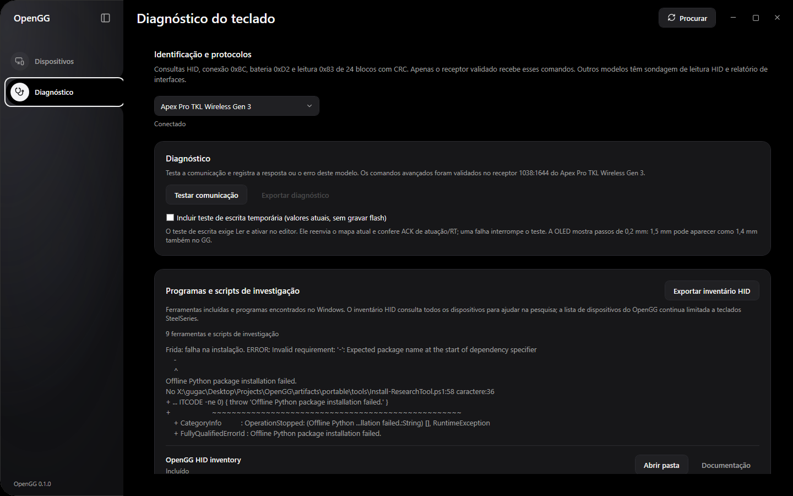
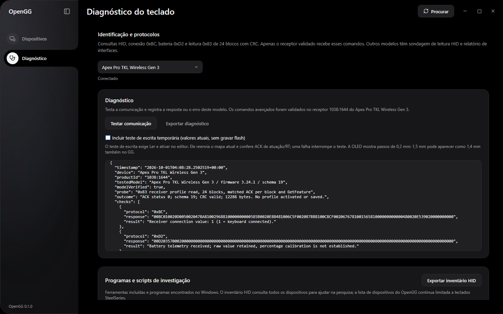
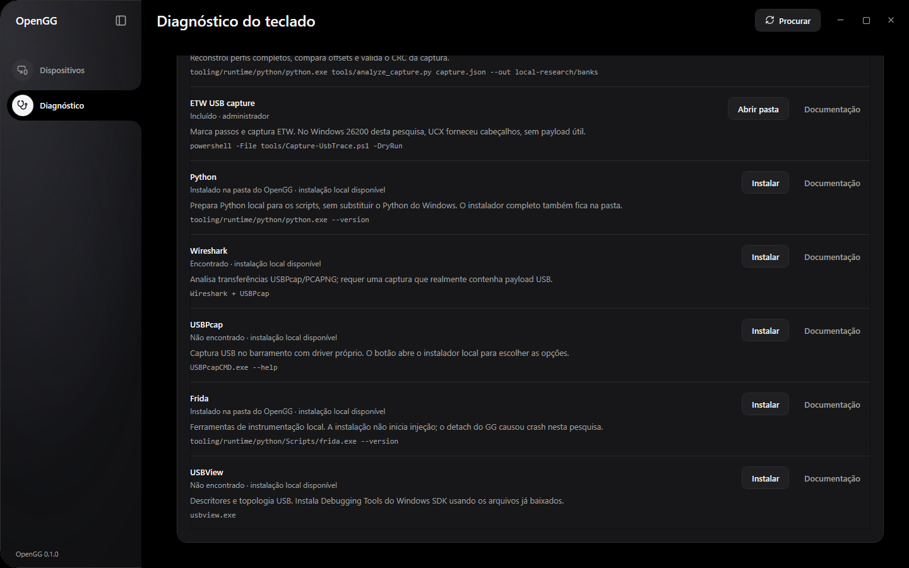

# Keyboard diagnostics and research tools

The sidebar Diagnostics section is specific to keyboard protocol research. Select a recognized card, run **Test communication** and optionally export the JSON. It includes device identity, interface/report lengths, attempted protocols, actual responses/errors, elapsed time and the local tool inventory.

Example completed communication report

## Tests by support level

| Test | Verified Apex receiver | Other keyboard model |
|---|---|---|
| Windows attributes/capabilities | VID/PID, version field, usage, report sizes and Container ID | Same read-only inventory |
| `BC` | Matching radio-connection response; value 1 required | Skipped |
| `D2` | Matching raw battery telemetry; percentage calibration not assumed | Skipped |
| `83` | Slot 2, 24 blocks, matching ACKs, 12,288-byte schema-19 CRC and SHA256 | Skipped |
| Live settings, opt-in | Re-send the currently loaded `6F`/`76` map, plus `77` if RT is active; require ACK zero | Skipped |
| Generic GetFeature | The dedicated known protocol is used instead | Report ID 0 on an available vendor feature collection; 5 s UI deadline |

The ordinary diagnostic does not activate a slot or erase/write profile flash. The opt-in live test requires the editor's Read and activate step and re-sends its **current** live values. It verifies transport acceptance without intentionally selecting a new threshold. If it fails, the loaded-state gate is cleared and the next edit requires another read.

An unknown model's GetFeature result is a transport read, **not a verified command ACK** and not configuration support. A report-ID-zero read can be unsupported; the resulting Windows error is useful evidence, not a reason to send random opcodes. If a synchronous driver request outlives the 5 s UI deadline, OpenGG retains that pending task and prevents repeated probes from creating more blocked requests.

Multiple matching verified receivers block advanced probes. A physical receiver can be present while its keyboard is off: the card describes HID presence, while `BC` checks the radio connection. Report the difference rather than treating receiver detection alone as wireless connectivity proof.

The `VersionNumber` field from HID attributes is a device revision field; it must not be relabeled as a parsed keyboard firmware version. “Tested firmware 3.24.1” in the report describes this project's hardware baseline. The app does not infer current firmware from that field or send a speculative `90` firmware opcode to every model.

## Included programs and scripts

| Tool | Where / command | Use |
|---|---|---|
| Native HID inventory | `OpenGG.exe --inspect --out inventory.json` | Read Windows attributes/caps for all HID collections and identify SteelSeries keyboards |
| Inventory wrapper | `tools/Inspect-Keyboards.ps1` in portable package | Same native export |
| Independent CLI | `python tools/opengg.py --help` | Profile read/edit/backup/write/load and consolidated live actuation/RT |
| Capture reconstruction | `python tools/analyze_capture.py capture.json --out local-research/banks` | Recover complete profiles, CRCs and changed offsets |
| Marked ETW capture | `tools/Capture-UsbTrace.ps1` | Capture and timestamp controlled vendor-app changes |
| Offline C# checks | `tests/OpenGG.Checks` | Discovery, strict verified identity, batching, preservation and CRC |
| Optional hardware check | `tests/OpenGG.Checks -- --hardware` | Continuous RGB plus one actuation batch; compare stored profile and reload slot 2 |
| Python checks | `python tools/test_opengg.py` | Byte editing, capture reconstruction, release ordering, batch preservation and failure injection |

The portable desktop does not need Python. **Prepare** on the protocol CLI installs local Python and hidapi from the included files. The capture analyzer prepares the same Python without extra modules. The capture helper requires administrator rights for an actual ETW session; `-DryRun` does not.

## External tool inventory

The app lists nine tool categories: its native inventory, protocol CLI, capture analyzer, ETW capture, Python, Wireshark, USBPcap, Frida and USBView. It checks PATH, selected Windows uninstall entries, known install locations and its own generated Python/Frida runtime. This is presence evidence, not proof that a capture driver is active. The installed local Python, Frida and hidapi were separately exercised during package verification.

Wireshark/USBPcap can provide bus-level transfer payloads, subject to the actual capture setup. [USBPcap source](https://github.com/desowin/usbpcap), [Wireshark guide](https://www.wireshark.org/docs/wsug_html_chunked/). [USBView](https://learn.microsoft.com/en-us/windows-hardware/drivers/debugger/usbview) is useful for USB topology and descriptors. [Frida](https://frida.re/docs/home/) can observe user-mode API calls, but its detach caused a crash in this investigation; use an isolated harness or bus capture first.

Every item has **Documentation** and an action button. **Install** for external Windows programs opens the real installer from `tooling/installers`; **Install** for Python/Frida and **Prepare** for the CLI/analyzer create the local runtime offline. Included inventory/ETW helpers offer **Open folder**. SDK Debugging Tools supplies USBView, with its offline layout already prepared. See [tool versions, payloads and installation](../tooling/README.md).

Before execution/extraction, the helper checks the selected payloads against `tooling/manifest.json` and rejects paths outside its cache. The UI waits asynchronously, disables additional install actions until completion, refreshes tool presence and records exit codes/output/errors in `%LOCALAPPDATA%\OpenGG\tool-install.log`. Missing files require re-preparing the cache; the install click never silently downloads a replacement. Capture-driver setup remains interactive. Installation does not attach Frida to GG or start a capture session. The HID export remains read-only and separate from keyboard card discovery.

## Evidence to share

Share the model, connection type, identity/caps, firmware as actually reported by vendor software, attempted query, reply or exact error and a controlled before/after comparison. A zero ACK proves acceptance; receiver readback proves receiver storage; neither measures physical switch depth. Remove raw profile contents, macros, unrelated process writes and serial identifiers from public issues. Raw inputs from this investigation stay in the local archive.
