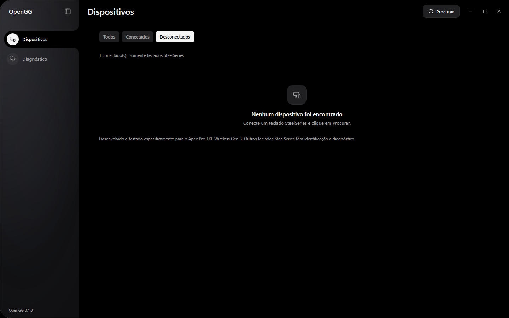

# Using OpenGG

## Portable app

Extract `OpenGG-0.1.0-win-x64.zip` into a folder you can write to. Open `OpenGG.exe` from that folder. The self-contained package includes the .NET runtime; no Python, GG installation, privileged service or installer is needed for the desktop.

The English Devices page uses the owner's original OneRGB device-card theme. The sidebar has only Devices and Diagnostics, with the original black selection contour when expanded and hover feedback when compact. It slides between layouts without changing the icon size; white OpenGG typography and version text fade. Windows' animation preference is respected. Window controls are integrated into the app, and its rounded corners use a native window region.

**Scan** (also F5) refreshes discovery; its refresh icon spins and the button becomes gray while scanning. There is no text search field. Cards show name and connection state; All, Connected and Disconnected filter the list. A recognized keyboard stays listed as disconnected when its HID collections disappear. With an empty discovery/filter result the page says **No devices found**.

The tested receiver's battery is queried every second through the shared HID channel and appears on its device card and editor status card. The bar animates while charging below full and stops at full charge. Read failures, unplugging or another active controller clear stale telemetry. The percentage is derived from quantized receiver values using OneRGB's existing mapping; it is not independently calibrated.

Only SteelSeries keyboard collections appear as device cards. Mice and unrelated vendors do not. A read-only inventory of all HID devices is available in Diagnostics for protocol research.

Empty device list

## Tested Apex model

1. Connect the Apex Pro TKL Wireless Gen 3 through its **2.4 GHz receiver**, `1038:1644`.
2. Exit SteelSeries GG/Engine, Prism, OneRGB, OpenRGB and SignalRGB if running. Closing OneRGB's window can leave it in the tray; use its Exit command.
3. Open the Apex card. The detailed keyboard editor and the owner's layered RGB artwork are included by default.
4. Choose onboard slot **1–5**. The default is slot 2; OpenGG does not infer the slot GG last activated.
5. Click **Read and activate**. This reads 24 blocks, verifies the CRC, activates that slot and seeds the complete live state.
6. Select a key, WASD or All and drag the vertical **down-arrow** slider beside the key map. The fill grows upward from the bottom. Changes apply after a 200 ms pause. All 60 visible analog keys are sent as one complete 68-entry report. Unselected keys retain their loaded values.
7. Click the **orange lightning** button, then click keys to paint Rapid Trigger. Click a painted key again to remove that feature. Its vertical lightning slider changes sensitivity on selected RT keys. The **blue shield** button paints Protection independently; its slider edits the selected protected keys' native raw sensitivity. Click the active paint button again to return to ordinary selection. Live actuation/RT do not write flash; Protection changes need the explicit save below.
8. Click **Save to keyboard** to persist. The app compares the stored profile with the baseline, backs it up, writes the keyboard and receiver copies, validates each and verifies exact receiver readback.

If the desired file already matches the onboard profile, saving skips the flash transaction. If the profile changed through another program, OpenGG requests a fresh read. A communication failure stops that resource's remaining changes and requires a new Read and activate before editing again.

RT and Protection buttons sit above their respective sliders and use gray controls/icons while inactive. Their active instruction is orange or blue. In painting mode, WASD/All enable that feature on matching keys and Clear removes it from all keys, preserving the other feature. In ordinary selection mode these buttons select or clear keys only.

## RGB and OLED

The Apex detail includes the original RGB control card: device-control switch, color presets, color/hex picker, brightness, speed, six modes and the PSD-layer preview. The native per-key frame uses the same serialized HID channel as actuation and profiles. Disabling control or leaving the editor releases temporary RGB, returning control to the onboard profile. RGB settings are retained when OpenGG closes normally.

RGB is the first editor section. Its editing card stretches to the height of the two stacked preview/status cards. The untitled status card shows battery, **Control RGB with OpenGG**, Sync and reserved profile/communication feedback. **Color / OLED** switch only the editing panel; effects, brightness and speed remain visible. The header holds the back arrow, device name and connection state. Scroll over any card to move the same page; a normal wheel notch advances 144 pixels. Onboard-profile controls and the three vertical sliders share the key-map card. Presets, Rapid Tap and Macros share a second card with tabs. The individual key editor expands below the map when exactly one key is selected.

Panel transitions fade and slide without shrinking the layout. Returning from an empty Rapid Tap or Macros tab preserves the previous bottom scroll position. OLED zoom fills the preview card, including the original resting margins, without an inner rectangular clipping limit.

The preview uses OneRGB's original continuous rainbow, rather than flattening multiple rows of LED colors across the image. Brightness fades the RGB layer's opacity over the gray PSD layers. At zero the original keyboard is visible; intermediate values also reveal that base. The hardware still receives RGB values scaled once by brightness.

Audio Reactive uses native WASAPI output loopback, only while that mode is active. It reads audio level for the effect and saves no recording. Wave, Color Cycle, Breathing, Static and Off are also available. RGB frames do not have a command ACK; the UI describes them as sends, while the diagnostic live-settings test checks actual ACKs.

Select **OLED** to zoom smoothly toward the actual display in the layered keyboard image. The same 128×40 preview also appears in the editing panel, with the simulation-depth slider and **Open File**. Import a PNG, JPEG, BMP, GIF or TIFF: Windows decodes the image, fits it without stretching, composites transparency over black and applies monochrome error-diffusion dithering. GIF and multi-page imports use the **first frame/page**, without animation. Limits are 16 MiB, 32 megapixels and 32,768 pixels per dimension.

A successful Open File enables the direct OLED send. The checkbox sends the exact preview bitmap via `4A`; turn it off to restore the profile background via `4B`. The reset icon returns the preview to OpenGG's status display. Changing simulation depth updates its simulated input display unless a custom image is selected. Image imports are temporary overlays for the current session; they are not automatically saved to profile flash or retained as local image files. Onboard OLED bytes are preserved during ordinary profile edits. Persist a bitmap using the CLI's explicit `oled_hex` profile edit. See the [visual editor guide](interface.md).

## Other keyboards

Any SteelSeries device with a standard keyboard HID collection (`usage page 1 / usage 6`) is eligible for discovery. Collections are grouped by Windows Container ID. Its generic page explains that advanced Gen 3 controls have not been validated on that model and offers Diagnostics. No Gen 3 actuation or flash command is guessed for it.

The receiver's USB presence is what the general Connected label represents. The `0xBC` diagnostic additionally checks whether the wireless keyboard is connected to that receiver. Bluetooth paths, models without a standard keyboard collection and two simultaneous matching Apex receivers need further validation. Two verified receivers block advanced operations to avoid selecting the wrong unit.

## Local files

| Location | Purpose |
|---|---|
| `%LOCALAPPDATA%\OpenGG\settings.json` | Remembered devices, local macro library, RGB preferences |
| `%LOCALAPPDATA%\OpenGG\profiles.json` | OpenGG's own editing profiles |
| `%LOCALAPPDATA%\OpenGG\operations.jsonl` | Requested values, batch completion and failures |
| `%LOCALAPPDATA%\OpenGG\apex-backups\` | Binary baseline before an onboard write |
| `%LOCALAPPDATA%\OpenGG\errors.log` | Desktop exceptions, if any |
| `%LOCALAPPDATA%\OpenGG\tool-install.log` | Local installer exit codes, output and errors |
| `tooling/installers/` | Prepared offline research installers and Python wheels |
| `tooling/runtime/python/` | Python/Frida/hidapi generated by Install or Prepare |

OpenGG does not use OneRGB's local profile or backup directory. A local editing profile is not a flash write; the explicit save button performs that transaction. Keep native backups if you want to restore an onboard profile later.

## Install research tools

Open **Diagnostics** and scroll to **Programs and investigation scripts**. Each item offers Documentation plus Install, Prepare or Open folder. Python and Frida install into this writable OpenGG folder. Wireshark, USBPcap and USBView open their local interactive installers. HID inventory and ETW scripts are already included. See [the offline tool guide](../tooling/README.md) for exact contents, checksums and commands.
