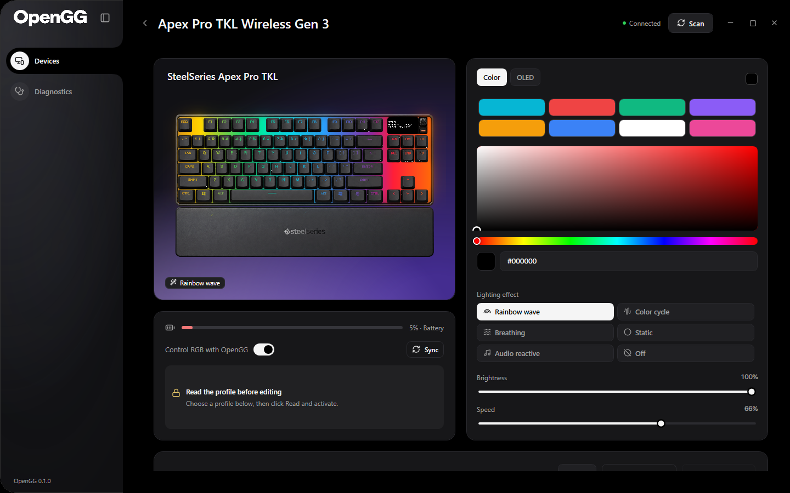
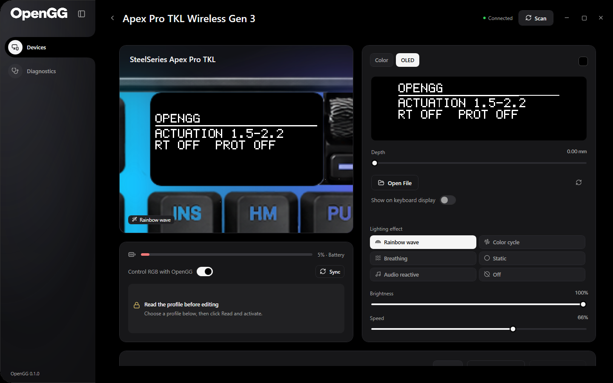
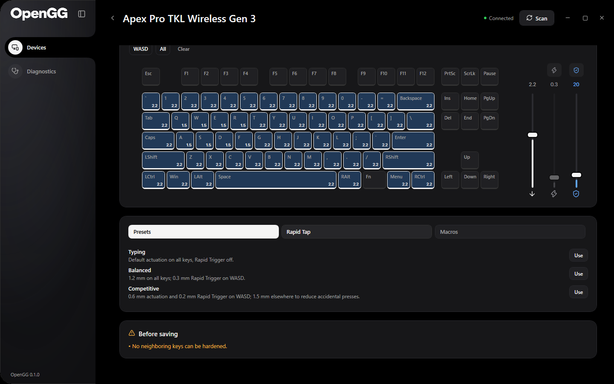

# The visual editor

Open the tested Apex device card to find RGB/OLED editing first, then the key map and one shared keyboard-tools card. The app keeps the owner's original OneRGB artwork and theme. The interface, messages, tooltips, generated OLED text and maintained documentation are English. User-created profile and macro names remain unchanged.

## Color and lighting



**Color** shows eight color presets, the color picker and hexadecimal input. Lighting effect, brightness and speed stay below that panel, including while editing OLED. The original broad rainbow runs continuously across the keyboard. Lower brightness reduces the overlay's opacity and reveals the gray keyboard beneath; it does not cover the base with dim black RGB pixels. Native RGB still scales each LED's output once.

The untitled status card keeps its existing size. Its first row shows live battery level, the second contains **Control RGB with OpenGG** and **Sync**, and the third reserves space for profile access, pending changes, communication errors and progress. Long details remain in tooltips. The shared page header carries connection state, Scan and the back button, with space above the controls.

## OLED images



1. Choose **OLED**. The keyboard camera moves toward the original artwork's display region over 360 ms and fills the complete preview stage. Resting margins belong to the camera transform, so they do not become an invisible clipping box when zooming. Choose Color to zoom back out. Reversing the transition uses its current camera position; reduced-motion preferences make the change immediate.
2. Use **Open File** to load a static image. PNG, JPEG, BMP, GIF and TIFF are supported through Windows' WPF decoders. The first frame/page is used for GIF/TIFF; animated playback is not implemented.
3. OpenGG preserves aspect ratio, adds black margins, places transparent pixels over black and converts colors into a 128×40 one-bit image using Floyd–Steinberg error diffusion. The panel and keyboard artwork show the same converted bitmap sent to the device.
4. Opening an image enables **Show on keyboard display**. A successful send reports the filename and `128 × 40`; a rejected or unavailable transport shows its actual error. Writes require the verified receiver and exclusive controller ownership. Turn that switch off to restore the profile background.
5. The reset icon returns to the generated OpenGG status preview. The depth slider runs the existing analog-input simulation for selected keys; with a custom image, that image remains displayed. Simulation is not a physical sensor readback.

Imports are limited to 16 MiB, 32 megapixels and 32,768 pixels per dimension. Images are decoded before replacing the current preview; a failed import preserves it. The direct `4A` overlay is temporary and the imported image is kept in memory for the current session. Ordinary onboard saves preserve the stored OLED background. Persistent OLED images use the CLI's explicit `oled_hex` field in vertical-page order, described in [profile format](profile-format.md).

## Actuation, Rapid Trigger and Protection



Choose onboard slot 1–5 in the map's header and click **Read and activate** before physical actuation/RT edits. This reads and activates the profile; it also replaces the editor values with the stored state. The separate profile card and long helper paragraphs have been removed. Progress/success detail is available in the profile controls' tooltip and shared status card; read/save errors remain visible.

| Control | Action |
|---|---|
| Down-arrow slider | Actuation in mm, always available; applies to selected adjustable keys |
| Orange lightning button | Enter/leave RT painting; click each supported key to add/remove RT |
| Lightning slider | RT sensitivity in mm; enabled while painting RT or selecting an RT key; changes selected RT keys |
| Blue shield button | Enter/leave Protection painting; click each supported key to add/remove Protection |
| Shield slider | Protection sensitivity, integer raw units 0–255; changes selected protected keys |
| WASD / All / Clear | In selection mode: select WASD, select all keys, or clear selection. In painting mode: enable the active feature on WASD/all supported keys, or remove it from all keys |
| Save to keyboard | Explicit onboard save with baseline comparison, backup and verification |

In the default selection mode, key clicks select/deselect. In a paint mode, each click changes only that feature and adds/removes that key from the current selection. Click the active paint button again to return to selection. The instruction becomes orange or blue and asks which keys to enable. Orange keys have RT; blue keys have Protection. A key with both features has a split orange/blue background. A light outline marks selection separately from those flags.

The paint buttons sit above their corresponding right-side sliders; WASD/All/Clear sit on the left. Sliders grow from the bottom upward. An inactive feature's button, slider and bottom icon are gray; the actuation control remains available. The slider's small value label uses English decimal formatting. Bulk painting schedules one consolidated edit rather than a send per key.

Selecting a key reads its values into the sliders; it never copies slider values to other selected keys. Slider edits use the existing 200 ms debounce. RT's global enable follows whether any key is painted; removing RT from a key preserves its Protection flag. Starting Protection painting from disabled state marks only the clicked key, rather than enabling an implicit WASD default.

Actuation/RT can apply live after profile activation, without flash writes. Protection selection and its raw sensitivity are pending profile edits until **Save to keyboard**. The raw byte has no confirmed mm conversion and its physical response is not calibrated across all 256 values. No live sensitivity opcode is invented. An expanded single-key editor retains remapping, Meta and dual actuation.

## One keyboard-tools card

The card beneath the map switches between **Presets**, **Rapid Tap** and **Macros**. Presets retain their named configurations; Rapid Tap retains pairing and priority controls; Macros retains its local data editor. The original boxed instructions and duplicate card titles have been removed. The macro editor accepts one data step per line, for example:

```text
tap W
down Shift
wait 50
up Shift
type hello
```

Mouse data steps include `mdown Left` and `mup Left`. Saving this library retains local macro data; compiling it into the keyboard's native macro container remains separate, unimplemented work. Raw containers can be preserved or edited explicitly through the [CLI](reproduce.md).

Color/OLED and Presets/Rapid Tap/Macros panels fade and slide in place. Hidden panels retain their measured space, so an empty Rapid Tap or Macros tab does not shrink the page or move the scroll position. Reversing a transition uses the current animated values; reduced-motion makes it immediate.

The page scrolls as one surface, including over cards, with a 144 px wheel step. [Verification](verification.md) records the actual WPF, bitmap-conversion, byte-preservation and native-window checks behind these behaviors.
